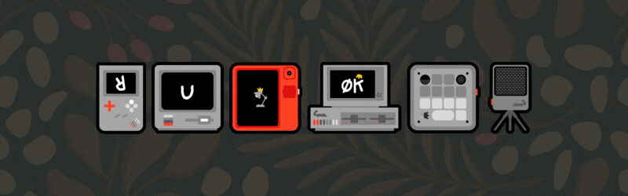
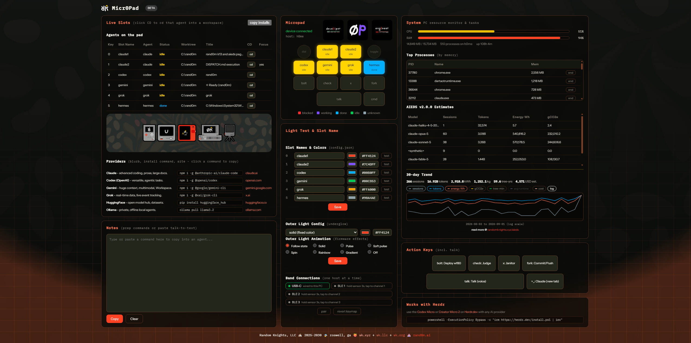

<a name="readme-top"></a>

<!-- HEADER -->
<div align="center">
  

<h3 align="center" style="color:#ff4124">0P_Micr0Pad</h3>

  <p align="center">
    Live AI-agent status lights on a Work Louder macropad.
    <br />
    <a href="docs/DEVELOPMENT.md"><strong>Explore the docs »</strong></a>
    <br />
    <br />
    <a href="https://worklouder.cc/codex-micro">Codex Micro</a>
    ·
    <a href="https://worklouder.cc/creator-micro-2">Creator Micro 2</a>
    ·
    <a href="https://herdr.dev">Herdr</a>
    ·
    <a href="https://github.com/random-knights/micr0pad/issues">Report Bug</a>
    ·
    <a href="https://github.com/random-knights/micr0pad/issues">Request Feature</a>
    <br />
    <br />
    &#127979; 2025-2030 &#128760; roswell, ga &#127825;
    <a href="https://randomknights.xyz">&#7450;k.xyz</a> +
    <a href="https://randomknights.llc">&#7450;k.llc</a> +
    <a href="https://randomknights.org">&#7450;k.org</a> &#127984;
    <a href="https://rand0m.ai">rand0m.ai</a>
  </p>
</div>

<!-- SUMMARY -->

## <span style="color:#555555"><u> **SUMMARY** </u></span>

Your agents are already running. MicroPad puts them on your desk.

It turns a **Work Louder Codex Micro** or **Creator Micro 2** into a live control
surface for AI coding agents: it reads agent state from [Herdr](https://herdr.dev),
the terminal multiplexer hosting them, and paints that state onto the pad's
per-key RGB. One glance tells you which agent is blocked, which is working and
which is done. Provider-neutral by design - Claude Code, Codex, Gemini, Grok,
HuggingFace, Ollama, or anything else Herdr runs.

No vendor app in the loop. The bridge speaks the device's own JSON-RPC over raw
HID, and everything it knows about your machine stays on it.

- Built with
  - Node.js, no build step, three dependencies deep
  - raw HID via `node-hid` - the vendor JSON-RPC interface, not a keyboard shim
  - [Herdr](https://herdr.dev) for agent state
  - Web Speech API for voice-to-text
  - [AIEDS v2.0.0](https://randomknights.xyz/aieds) for energy and carbon estimates
  - a browser UI in plain HTML, CSS and JS - view source and read the whole thing

<p align="right">(<a href="#readme-top">back to top</a>)</p>

<!-- SCREENS -->

## <span style="color:#555555"><u> **THE APP** </u></span>

<div align="center">
  
</div>

Left: the live agent table and the provider install commands. Middle: the pad
mirror, the light and slot editor, and the connection bands. Right: the system
monitor and the AIEDS energy panel, with the action keys and Herdr underneath.

<p align="right">(<a href="#readme-top">back to top</a>)</p>

<!-- WHAT IT DOES -->

## <span style="color:#555555"><u> **WHAT IT DOES** </u></span>

- **Per-key agent status.** Six keys, one agent each, coloured by state - blocked
  red, working purple, done blue, idle yellow - with a per-slot identity colour
  so two Claudes can be told apart. The underglow carries the worst state across
  all of them, so the pad is readable from across the room.
- **Browser mirror** at `http://localhost:4120` - every key, the dial and the
  joystick, reflecting the physical device in real time.
- **Action keys that run your commands.** Four action keys plus a terminal key.
  They ship unconfigured: set a label and a command per key from the gear in the
  Action Keys tile, and they work whether you press the pad or click the button.
- **Talk key** - voice-to-text into the Notes box and the clipboard, with a gold
  underglow pulse while listening.
- **Slot names, colours and outer-light effects** edited in the browser and saved
  to `config.json` - every firmware effect is selectable (solid, breathing,
  snake, rainbow, gradient, shallow breath, off).
- **System panel** - CPU, RAM, top processes with end-task, and optional AIEDS
  energy, carbon and cost estimates for your own AI sessions with a 30-day trend.
- **Pairing and revert** - hand the LEDs back to the firmware for Bluetooth
  pairing, or restore the device's original keymap.

### The pad

```
 ( dial )  [ agent 1 ] [ agent 2 ]  ( toggle )    <- encoder, two keys, joystick
 [agent 3] [ agent 4 ] [ agent 5 ] [ agent 6 ]    <- the six status keys
 [action 1] [action 2] [action 3] [ action 4 ]    <- your commands
 [        talk (wide)        ] [   terminal   ]
```

<p align="right">(<a href="#readme-top">back to top</a>)</p>

<!-- HARDWARE -->

## <span style="color:#555555"><u> **HARDWARE** </u></span>

| | |
|---|---|
| Device | Work Louder [Codex Micro](https://worklouder.cc/codex-micro) or [Creator Micro 2](https://worklouder.cc/creator-micro-2) |
| Verified on | Codex Micro, VID `0x303a` PID `0x8360`, firmware v0.4.1 |
| Host | Windows - the process list and command launchers use Windows tooling |
| Needs | [Herdr](https://herdr.dev) on `PATH`, Node.js 18+ |

<p align="right">(<a href="#readme-top">back to top</a>)</p>

<!-- GET STARTED -->

## <span style="color:#555555"><u> **GET STARTED** </u></span>

```powershell
git clone https://github.com/random-knights/micr0pad
cd micr0pad
npm i
```

Herdr, if you do not already have it:

```powershell
powershell -ExecutionPolicy Bypass -c "irm https://herdr.dev/install.ps1 | iex"
```

**Back up the device keymap before anything writes to it.** It is the only way
back to stock, and the app refuses to overwrite the backup once it exists:

```powershell
npm run backup-keymap
```

Then bind the dial and joystick, and give the touch sensor layers to cycle
through. Both of these write to device flash:

```powershell
npm run bind-dial-joy
npm run add-layers -- --write     # omit --write for a dry run
```

Start it:

```powershell
run.cmd
```

or `node server.js`, then open `http://localhost:4120`.

### Configure the action keys

The four action keys and the terminal key start empty on purpose - shipping one
team's scripts would give everyone else dead buttons. Click the gear in the
**Action Keys** tile, give each key a label and a command, tick **run**. The
editor shows which directory commands resolve from; drop your scripts there, or
point `cmdDir` in `config.json` somewhere else. Search order:

1. `MICROPAD_CMD_DIR`
2. `cmdDir` in `config.json`
3. `<app>/cmd`
4. a sibling `_macropad` folder

The app runs on built-in defaults until you change something; the first save
writes `config.json`, which is then yours - slot matching rules, colours, action
commands and the outer light all live there. `config.example.json` is the same
structure to crib from, and `RK_MICROPAD_PORT` moves the server off 4120.

<p align="right">(<a href="#readme-top">back to top</a>)</p>

<!-- AIEDS -->

## <span style="color:#555555"><u> **ENERGY REPORTING (OPTIONAL)** </u></span>

The System panel can report modelled energy, carbon and cost for your own agent
sessions using the [AI Energy Disclosure Standard](https://randomknights.xyz/aieds)
v2.0.0. It is opt-in and entirely local: nothing is recorded until you install
the hook, and nothing ever leaves the machine.

Add the SessionEnd hook to `~/.claude/settings.json`:

```json
{
  "hooks": {
    "SessionEnd": [
      { "hooks": [ { "type": "command", "command": "node",
        "args": ["<path-to-repo>/hooks/aieds-local.js"] } ] }
    ]
  }
}
```

The hook reads the session's own transcript, sums the token counts the API
actually reported, and appends one line per model to `aieds-local.jsonl`
(override the location with `AIEDS_LOG_PATH`, and give the server the same value
so both ends agree).

Costs are a **modelled list price, not a bill.** Rates live in
`lib/aieds-rates.json`; a model with no entry there gets no cost figure rather
than a guessed one. Energy, carbon and tree-time are fixed multiples of each
other in AIEDS v2, so those three lines coincide on the chart by construction.

<p align="right">(<a href="#readme-top">back to top</a>)</p>

<!-- CREDITS -->

## <span style="color:#555555"><u> **CREDITS** </u></span>

- [schacon/micro-manager](https://schacon.github.io/micro-manager/) - the reverse
  engineering of this device's JSON-RPC surface, its effect table and the
  key-binding rules. This project would not exist without it.
- [Herdr](https://herdr.dev) - the agent runtime this reads from.
- [Work Louder](https://worklouder.cc) - the hardware.

Questions, bugs and ideas: [open an issue](https://github.com/random-knights/micr0pad/issues).

## <span style="color:#555555"><u> **LICENSE** </u></span>

MIT - see [LICENSE](LICENSE).

<p align="right">(<a href="#readme-top">back to top</a>)</p>
