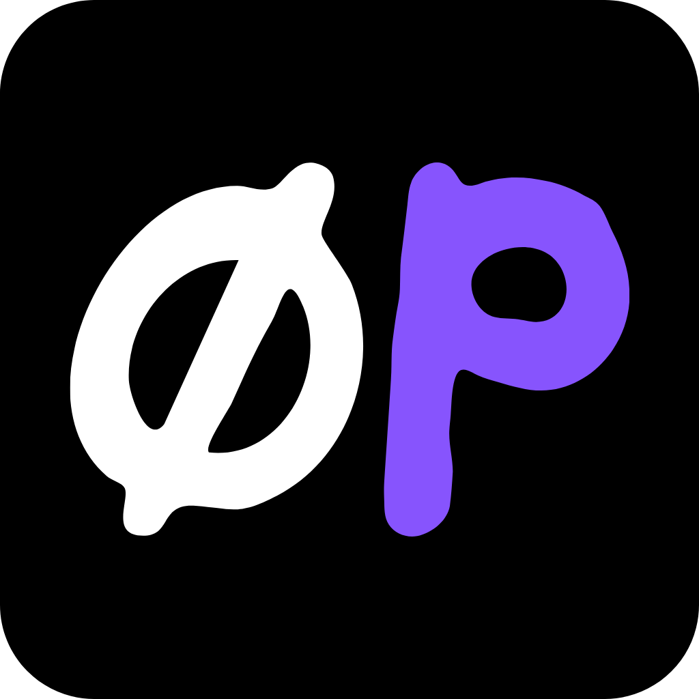

<a name="readme-top"></a>

<div align="center">
  

<h3 align="center" style="color:#ff4124">0P_Micr0Pad</h3>

  <p align="center">
    Live AI-agent status lights on a Work Louder macropad.
    <br />
    <a href="https://worklouder.cc/codex-micro">Codex Micro</a>
    &middot;
    <a href="https://worklouder.cc/creator-micro-2">Creator Micro 2</a>
    &middot;
    <a href="https://herdr.dev">Herdr</a>
    <br />
    <br />
    &#127979; 2025-2030 &#128760; roswell, ga &#127825;
    <a href="https://randomknights.xyz">&#7450;k.xyz</a> +
    <a href="https://randomknights.llc">&#7450;k.llc</a> +
    <a href="https://randomknights.org">&#7450;k.org</a> &#127984;
    <a href="https://rand0m.ai">rand0m.ai</a>
  </p>
</div>

---

## SUMMARY

MicroPad turns a **Work Louder Codex Micro** or **Creator Micro 2** into a live
control surface for AI coding agents. It reads agent state from
[Herdr](https://herdr.dev) - the terminal multiplexer that hosts the agents - and
paints it onto the pad's per-key RGB, so a glance at the desk tells you which
agent is blocked, working, done or idle. It is provider-neutral: Claude Code,
Codex, Gemini, Grok, HuggingFace, Ollama, or anything else Herdr runs.

There is no vendor app in the loop. The bridge speaks the device's own JSON-RPC
over raw HID.

- **Per-key agent status.** Six keys, one agent each, coloured by state
  (blocked red, working purple, done blue, idle yellow) with a per-slot identity
  colour override. The underglow carries the worst state across all agents.
- **Browser mirror** of the whole pad at `http://localhost:4120`, including the
  dial and joystick, which flash when the physical controls are used.
- **Action keys** run whatever you tell them to. They ship UNCONFIGURED -
  naming one team's scripts would give every other install dead buttons - so
  set each key from the gear in the Action Keys tile: a label, the command, and
  whether it runs. Commands are looked for in MICROPAD_CMD_DIR, the config
  cmdDir, <app>/cmd, then a sibling _macropad folder, and the editor shows you
  which directory it resolved. Keys work with or without the browser open.
- **Talk key** - Web Speech voice-to-text. The transcript lands in the Notes
  box and on the clipboard, with a gold underglow pulse while listening.
  Dictation needs the MicroPad tab focused: Chrome will not listen for a
  background document, so pressing talk ON THE PAD while you work elsewhere
  lights the pulse and says so rather than failing silently. Set
  `"focusBrowserOnTalk": true` in config.json to have the pad raise the window
  first.
- **Slot names, colours and outer-light effects** edited in the browser and
  saved to `config.json`; every firmware effect (solid, breathing, snake,
  rainbow, gradient, shallow breath, off) is selectable.
- **System panel** - CPU, RAM, top processes with end-task, and AIEDS v2.0.0
  energy/carbon estimates for your own AI sessions with a 30-day trend.
- **Pairing and revert** - hand the LEDs back to the firmware for Bluetooth
  pairing, or restore the device's original keymap.

Built with Node.js, raw HID (`node-hid`), and no build step.

## HARDWARE

| | |
|---|---|
| Device | Work Louder [Codex Micro](https://worklouder.cc/codex-micro) or [Creator Micro 2](https://worklouder.cc/creator-micro-2) |
| Verified on | Codex Micro, VID `0x303a` PID `0x8360`, firmware v0.4.1 |
| Host | Windows (the process list and launchers use Windows commands) |
| Requires | [Herdr](https://herdr.dev) on `PATH`, Node.js 18+ |

## INSTALL

```powershell
git clone https://github.com/random-knights/micr0pad
cd micr0pad
npm i
```

Install Herdr if you do not have it:

```powershell
powershell -ExecutionPolicy Bypass -c "irm https://herdr.dev/install.ps1 | iex"
```

Back up the device keymap **before** anything writes to it - this is the only
way back to stock:

```powershell
npm run backup-keymap
```

Then bind the dial and joystick so the app can drive model cycling and pane
navigation, and give the touch sensor layers to cycle through:

```powershell
node bind-dial-joy.js
node add-layers.js --write
```

## RUN

```powershell
run.cmd
```

or `node server.js`, then open `http://localhost:4120`.

`config.json` is created from `config.example.json` on first run and is yours to
edit - slot matching rules, colours, and what each action key launches.

## AIEDS ENERGY REPORTING (OPTIONAL)

The System panel can report modelled energy, carbon and cost for your own agent
sessions using the [AI Energy Disclosure Standard](https://randomknights.xyz/aieds)
v2.0.0. It is opt-in: nothing is collected until you install the hook.

Add this to `~/.claude/settings.json`:

```json
{
  "hooks": {
    "SessionEnd": [
      { "hooks": [ { "type": "command", "command": "node",
        "args": ["<path-to-repo>/hooks/aieds-local.js"] } ] }
    ]
  }
}
```

The hook reads the session's own transcript, sums the real token counts the API
reported, and appends one line per model to `aieds-local.jsonl` in the repo
(override with `AIEDS_LOG_PATH`, and set the same value for the server so both
ends agree). Nothing leaves the machine.

Costs are a **modelled list price**, not a bill - rates live in
`lib/aieds-rates.json` and a model with no entry there gets no cost figure
rather than a guessed one.

## CREDITS

- [schacon/micro-manager](https://schacon.github.io/micro-manager/) - the
  reverse engineering of this device's JSON-RPC surface, the effect table and
  the AG-binding rules. This project would not exist without it.
- [Herdr](https://herdr.dev) - the agent runtime this reads from.
- [Work Louder](https://worklouder.cc) - the hardware.

## LICENSE

MIT - see [LICENSE](LICENSE).

<p align="right">(<a href="#readme-top">back to top</a>)</p>
