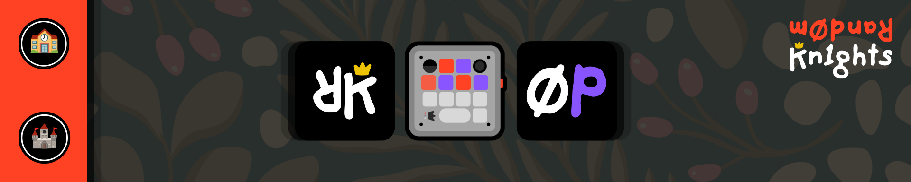

<a name="readme-top"></a>

<!-- HEADER -->
<div align="center">
  

<h3 align="center" style="color:#ff4124">0P_Micr0Pad</h3>

  <p align="center">
    Live AI-agent status lights on a Work Louder macropad.
    <br />
    <a href="docs/DEVELOPMENT.md"><strong>Explore the docs »</strong></a>
    <br />
    <br />
    <a href="https://worklouder.cc/codex-micro">Codex Micro</a>
    ·
    <a href="https://worklouder.cc/creator-micro-2">Creator Micro 2</a>
    ·
    <a href="https://herdr.dev">Herdr</a>
    ·
    <a href="https://github.com/random-knights/micr0pad/issues">Report Bug</a>
    ·
    <a href="https://github.com/random-knights/micr0pad/issues">Request Feature</a>
    <br />
    <br />
    &#127979; 2025-2030 &#128760; roswell, ga &#127825;
    <a href="https://randomknights.xyz">&#7450;k.xyz</a> +
    <a href="https://randomknights.llc">&#7450;k.llc</a> +
    <a href="https://randomknights.org">&#7450;k.org</a> &#127984;
    <a href="https://rand0m.ai">rand0m.ai</a>
  </p>
</div>

<!-- SUMMARY -->

## <span style="color:#555555"><u> **SUMMARY** </u></span>

Your agents are already running. This puts them on your desk, where you can see
them without switching windows.

MicroPad turns a **Work Louder Codex Micro** or **Creator Micro 2** into a status
board for AI coding agents. It reads agent state from [Herdr](https://herdr.dev),
the terminal multiplexer that hosts them, and paints that state onto the pad's
per-key lights. One key per agent. Red means blocked, purple means working, blue
means done, yellow means idle. The strip underneath carries the worst state of
the six, so the pad is readable from across the room.

It does not care which AI you use. Claude Code, Codex, Gemini, Grok, Hugging
Face, Ollama, anything Herdr can run.

No vendor app sits in the middle. The bridge speaks the device's own JSON-RPC
over raw HID, and what it learns about your machine stays on your machine.

- Built with
  - Node, no build step. One dependency, `node-hid`, which brings two more in
    with it (a clean install reports three packages).
  - raw HID, the vendor JSON-RPC interface, not a keyboard shim
  - [Herdr](https://herdr.dev) for agent state
  - the browser's own speech recognition for voice to text
  - [AIEDS v2.0.0](https://randomknights.xyz/aieds) for energy and carbon
    estimates, off until you ask for them
  - a browser page in plain HTML, CSS and JS. View source and you have read the
    whole client.

<p align="right">(<a href="#readme-top">back to top</a>)</p>

<!-- INSTALL -->

## <span style="color:#555555"><u> **INSTALL** </u></span>

Two commands, and the second one is the whole install:

```powershell
git clone https://github.com/random-knights/micr0pad
cd micr0pad
npm start
```

`npm start` installs the dependencies if they are missing, writes your
`config.json` from the checked-in example on the first run, and then starts the
server. Open **http://localhost:4120**.

You need Node 18 or newer. If yours is older the app says so, with your version
number, instead of failing later somewhere confusing.

Agent lights need [Herdr](https://herdr.dev) installed and on your `PATH`.
Without it the pad still runs and the six slots simply sit idle:

```powershell
powershell -ExecutionPolicy Bypass -c "irm https://herdr.dev/install.ps1 | iex"
```

### Before you flash anything

Two of the setup scripts write to the device's flash memory. Back up the keymap
first. It is the only way back to a pad that behaves like the one you bought,
and the backup refuses to overwrite itself once it exists, so run it before
anything else touches the device:

```powershell
npm run backup-keymap
```

Then, optionally, bind the dial and the joystick, and give the touch sensor some
layers to cycle through. Both of these write to flash:

```powershell
npm run bind-dial-joy
npm run add-layers -- --write     # leave off --write to see what it would do
```

If port 4120 is taken, set `RK_MICROPAD_PORT` to something else before starting.

<p align="right">(<a href="#readme-top">back to top</a>)</p>

<!-- WHAT IT DOES -->

## <span style="color:#555555"><u> **WHAT IT DOES** </u></span>

- **A key per agent.** Six of them. Each one takes the colour of its agent's
  state, and each slot keeps its own identity colour, so two Claudes are still
  two different keys.
- **A mirror in the browser** at `http://localhost:4120`. Every key, the dial
  and the joystick, following the real device as you touch it.
- **Action keys that run your commands.** Four of them, plus a terminal key.
  They ship pointing at nothing: shipping one team's scripts would give
  everyone else buttons that can only fail. Click the gear in the Action Keys
  tile, give a key a label and a command, and it works from the pad and from
  the page.
- **A talk key.** It types what you say into the notes box and the clipboard,
  and the strip pulses gold while it is listening. Speech recognition is the
  browser's, so the tab has to be in front; press talk while you are working
  elsewhere and the app tells you that rather than going quiet.
- **Lights you can edit.** Slot names, colours and the outer light, saved to
  `config.json`. Eight choices in the effect list: follow the agent state, or
  pick one of the seven the firmware has (solid, pulse, soft pulse, spin,
  rainbow, gradient, off).
- **A system panel.** CPU, memory, the top processes with an end task button,
  and an optional energy panel described below.
- **Pairing and revert.** Hand the lights back to the firmware so you can pair
  the pad over Bluetooth, or put the original keymap back.

### The pad

```
 ( dial )  [ agent 1 ] [ agent 2 ]  ( toggle )    encoder, two keys, joystick
 [agent 3] [ agent 4 ] [ agent 5 ] [ agent 6 ]    the six status keys
 [action 1] [action 2] [action 3] [ action 4 ]    your commands
 [        talk (wide)        ] [   terminal   ]
```

<p align="right">(<a href="#readme-top">back to top</a>)</p>

<!-- HARDWARE -->

## <span style="color:#555555"><u> **HARDWARE** </u></span>

| | |
|---|---|
| Device | Work Louder [Codex Micro](https://worklouder.cc/codex-micro) or [Creator Micro 2](https://worklouder.cc/creator-micro-2) |
| Verified on | Codex Micro, VID `0x303a` PID `0x8360`, firmware v0.4.1 |
| Host | Windows. The process list and the command launchers use Windows tools. |
| Needs | Node 18 or newer, and [Herdr](https://herdr.dev) for the agent lights |

Only one program at a time can hold the device. If the pad looks dead, another
copy of this server is usually still running.

<p align="right">(<a href="#readme-top">back to top</a>)</p>

<!-- CONFIGURE -->

## <span style="color:#555555"><u> **CONFIGURE** </u></span>

Everything you change in the browser is saved to `config.json`, which is created
for you on the first run and is never committed. Slot matching, colours, action
commands, the outer light and the pairing token all live there.
`config.example.json` is the same shape, checked in, to read or copy from.

The action keys look for your `.cmd` files in this order, and the editor shows
you which directory it settled on:

1. `MICROPAD_CMD_DIR`
2. `cmdDir` in `config.json`
3. `<app>/cmd`
4. a `_macropad` folder beside the app

<p align="right">(<a href="#readme-top">back to top</a>)</p>

<!-- WHAT LEAVES -->

## <span style="color:#555555"><u> **WHAT LEAVES YOUR MACHINE** </u></span>

Nothing, by design. There is no account, no sign in, and no server of ours to
talk to.

What the app does guard is itself. Any page in any browser tab can send a
request to `localhost`, and this app can end processes and run commands, so
every request that changes something has to prove two things: it came from the
app's own page, and it carries the pairing token that was minted into your
`config.json` on first run. Without both, the answer is a refusal, not an
action. The token is a secret. It is never printed, never logged and never
returned to a page from another origin.

One caveat, stated plainly: the read-only routes are open to any origin. A page
you visit cannot press a key or kill a process, but it can read what the status
panel reads, which includes your machine's name and a list of running process
names. If that matters to you, do not run the server while browsing untrusted
sites.

<p align="right">(<a href="#readme-top">back to top</a>)</p>

<!-- ENERGY -->

## <span style="color:#555555"><u> **ENERGY REPORTING (OPTIONAL)** </u></span>

The system panel can show modelled energy, carbon and cost for your own agent
sessions, using the
[AI Energy Disclosure Standard](https://randomknights.xyz/aieds) v2.0.0. A fresh
install shows an empty panel and records nothing. It starts only when you add
the hook.

For Claude Code, add a SessionEnd hook to `~/.claude/settings.json`:

```json
{
  "hooks": {
    "SessionEnd": [
      { "hooks": [ { "type": "command", "command": "node",
        "args": ["<path-to-repo>/hooks/aieds-local.js"] } ] }
    ]
  }
}
```

The hook reads that session's own transcript, adds up the token counts the API
reported, and appends one line per model to `aieds-local.jsonl` beside the app.
Set `AIEDS_LOG_PATH` to put it somewhere else, and give the server the same
value so both ends read the same file.

Cost is a **modelled list price, not a bill.** Rates live in
`lib/aieds-rates.json`, and a model that is not in that file gets no cost figure
rather than a guessed one. In AIEDS v2 energy, carbon and tree time are fixed
multiples of each other, which is why those three lines sit on top of one
another on the chart.

<p align="right">(<a href="#readme-top">back to top</a>)</p>

<!-- ANALYTICS -->

## <span style="color:#555555"><u> **ANALYTICS (OFF UNTIL YOU SAY OTHERWISE)** </u></span>

There is a small local log of what the pad costs to run. It is off. Nothing is
written, and no file is created, until you turn it on:

```json
{ "analytics": { "enabled": true } }
```

in `config.json`, or `MICR0PAD_ANALYTICS=1` in the environment. Read it back
with `npm run analytics`, and turn it off again by deleting the file and the
setting.

It writes one line when the server stops: how long it ran, how long the pad was
attached, how many times the lights were repainted, and how much processor time
the server used. That is the whole list.

It does not record your machine name, your user name, your folders, your window
titles, your agent or slot names, your action key labels or commands, or which
keys you pressed. Those were considered and dropped, not shortened or hashed. A
count of repaints is the cost of running something. A record of presses is a
record of a person.

Nothing is sent anywhere. There is nowhere to send it: the app has no analytics
endpoint and opens no connection for one. The file is yours, it is ignored by
git, and deleting it undoes everything it ever recorded.

Energy in watt hours is not modelled here. AIEDS v2 models energy from AI token
counts, and there is no sourced figure for what this device draws, so the log
carries the measurements and says the energy number is unavailable rather than
printing a guess with a unit on it.

<p align="right">(<a href="#readme-top">back to top</a>)</p>

<!-- DEVELOPMENT -->

## <span style="color:#555555"><u> **DEVELOPMENT** </u></span>

```powershell
npm test           # the test suite, node:test, no framework
npm run analytics  # totals from the local analytics log
npm run probe      # ask the device what it is
```

There is no build step. `public/` is served exactly as it is written.

CI runs the same `npm test` on every pull request. It installs without building
the native module, because nothing under test opens a device and the runner has
no pad plugged into it. Anything that needs real hardware is checked by hand
against a real pad, and [docs/DEVELOPMENT.md](docs/DEVELOPMENT.md) says which
parts those are.

<p align="right">(<a href="#readme-top">back to top</a>)</p>

<!-- CREDITS -->

## <span style="color:#555555"><u> **CREDITS** </u></span>

- [schacon/micro-manager](https://schacon.github.io/micro-manager/) worked out
  this device's JSON-RPC surface, its effect table and its key binding rules.
  This project would not exist without that work.
- [Herdr](https://herdr.dev), the agent runtime this reads from.
- [Work Louder](https://worklouder.cc), the hardware.

Questions, bugs and ideas: [open an issue](https://github.com/random-knights/micr0pad/issues).

## <span style="color:#555555"><u> **LICENSE** </u></span>

MIT. See [LICENSE](LICENSE).

<p align="right">(<a href="#readme-top">back to top</a>)</p>
